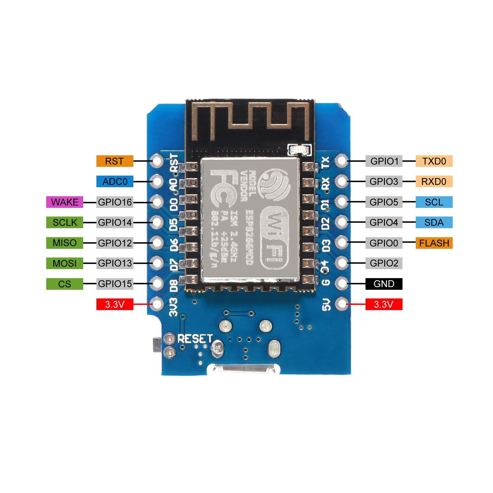
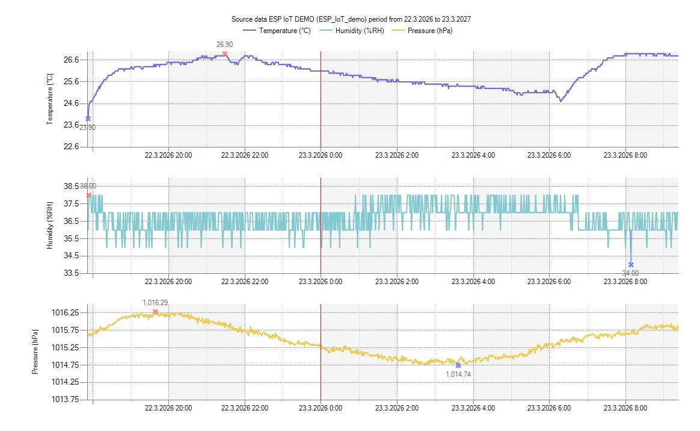

# ESP AVE Data Logger

Firmware for an ESP8266-based IoT sensor node that periodically measures environmental data and uploads it to the [AVE System](https://www.ave-system.com/en/home/index) cloud platform.

---

## Overview

The device wakes up on a fixed interval, reads temperature, humidity, and barometric pressure from onboard sensors, and transmits the data over HTTPS to an AVE System endpoint. After each upload the WiFi radio is shut down and the board waits until the next cycle, keeping power consumption low.

**Measured values**

| Value | Sensor | Unit |
|---|---|---|
| Temperature | BMP180 (calibrated) | °C |
| Humidity | DHT11 | %RH |
| Pressure | BMP180 → sea-level corrected | hPa |

---

## Hardware

The firmware targets the **ESP8266** microcontroller (NodeMCU / Wemos D1 mini class boards).



### Sensor wiring

| Sensor | Signal | ESP8266 pin |
|---|---|---|
| DHT11 | Data | GPIO2 |
| BMP180 | SDA | GPIO4 (D2) |
| BMP180 | SCL | GPIO5 (D1) |

Power both sensor modules from the board's 3.3 V rail with a common GND.

---

## Telemetry cycle

Each loop iteration runs the following steps in order:

1. Connect to WiFi
2. Synchronise UNIX time via NTP
3. Read DHT11 (humidity) and BMP180 (temperature + pressure)
4. Convert station pressure to sea-level pressure
5. Upload a single HTTPS GET request to the AVE System endpoint
6. Disconnect WiFi and wait for the next interval

A startup self-test (WiFi reachability, NTP, sensor sanity checks) runs once on boot before the main loop begins.

---

## Data in AVE System

Collected measurements are visualised in [AVE System](https://www.ave-system.com/en/home/index) — an IoT data platform that stores time-series data and renders interactive charts.



---

## Build & flash

The project uses [PlatformIO](https://platformio.org/). Target environment: `nodemcuv2` (espressif8266 / arduino framework).

```bash
# Build
platformio run --environment nodemcuv2

# Upload
platformio run --target upload --environment nodemcuv2

# Serial monitor (115200 baud)
platformio device monitor --baud 115200
```

---

## Configuration

Edit `include/config.h` and `src/config.cpp` to set your network credentials, device ID, endpoint URL, and physical constants (altitude for pressure correction, temperature calibration offset, loop interval, etc.).

---

## Developer guide

For full module descriptions, wiring details, runtime flow, logging conventions, and extension ideas, see [DEVELOPER_GUIDE.md](DEVELOPER_GUIDE.md).
